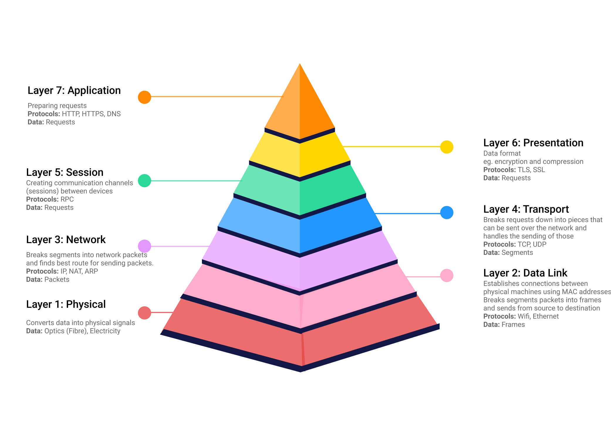
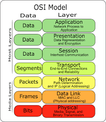
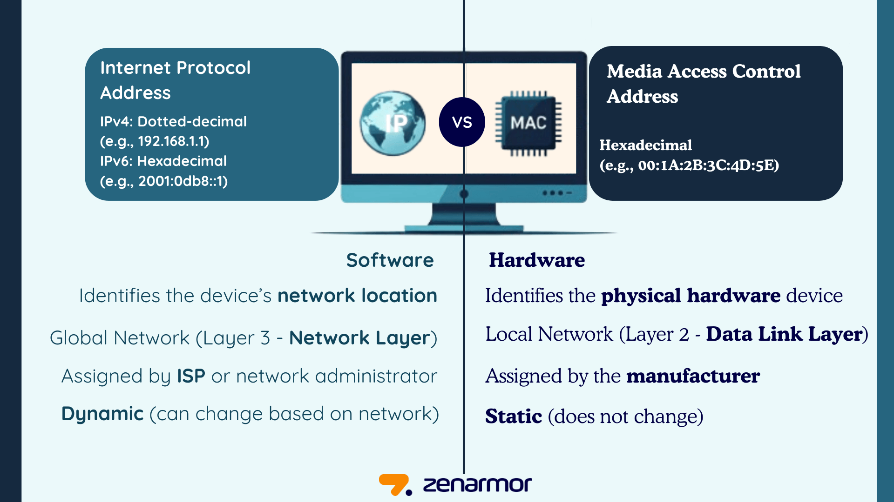
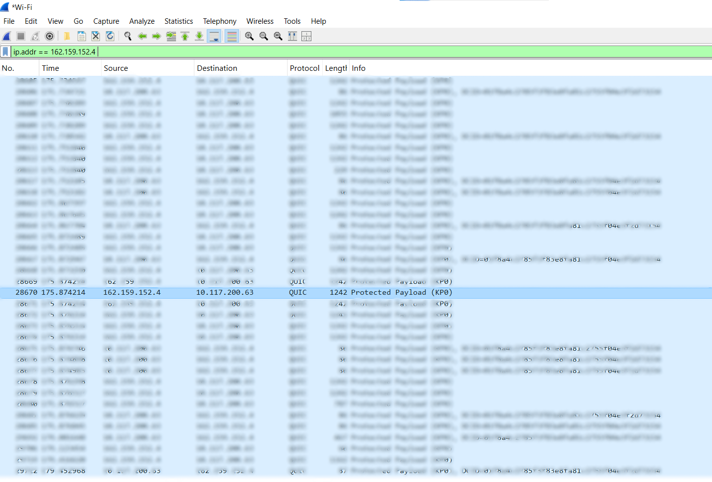

# OSI Model Visual Guide

## Layer Architecture Diagrams

### 1. OSI Model Overview
  
*Fig 1.1: The 7-layer OSI reference model*

---

### 2. OSI Model Layers
  
*Fig 1.2: How data moves through the OSI layers*

---

### 3. IP vs MAC
  
*Fig 1.3: IP Adress Compared to MAC Address*

---

### 4. Wireshark Analysis
  
*Fig 1.4: Conducted an anlysis using Wireshark*

---

> **Note**: Replace `images/` paths with your actual image locations. Recommended image size: 800x600px for optimal readability.
